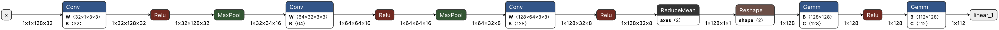
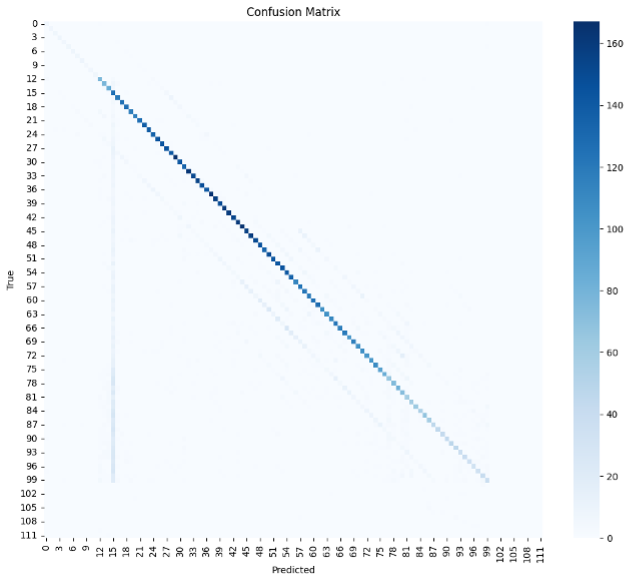

CNN CQT time frame 32 random slice

Modell Struktur:

Confusion Matrix:

Treningslogg:

LR: 0.001000
Epoch 01 | Train Loss: 2.6673 | Train Acc: 0.446 | Val Loss: 2.0707 | Val Acc: 0.636 | Time: 1063.8s  | 
Top1: 0.636 | Top3: 0.780 | Err: 9.91 | ±1: 0.644 | ±2: 0.647

LR: 0.001000
Epoch 02 | Train Loss: 2.0704 | Train Acc: 0.641 | Val Loss: 1.8888 | Val Acc: 0.692 | Time: 209.9s  | 
Top1: 0.692 | Top3: 0.814 | Err: 5.33 | ±1: 0.705 | ±2: 0.713

LR: 0.001000
Epoch 03 | Train Loss: 1.9473 | Train Acc: 0.676 | Val Loss: 1.8222 | Val Acc: 0.703 | Time: 125.8s  | 
Top1: 0.703 | Top3: 0.822 | Err: 5.26 | ±1: 0.711 | ±2: 0.717

LR: 0.001000
Epoch 04 | Train Loss: 1.8818 | Train Acc: 0.693 | Val Loss: 1.7584 | Val Acc: 0.727 | Time: 155.3s  | 
Top1: 0.727 | Top3: 0.831 | Err: 5.13 | ±1: 0.737 | ±2: 0.745

LR: 0.001000
Epoch 05 | Train Loss: 1.8394 | Train Acc: 0.705 | Val Loss: 1.7426 | Val Acc: 0.731 | Time: 135.0s  | 
Top1: 0.731 | Top3: 0.833 | Err: 4.76 | ±1: 0.738 | ±2: 0.744

LR: 0.001000
Epoch 06 | Train Loss: 1.8083 | Train Acc: 0.714 | Val Loss: 1.7157 | Val Acc: 0.738 | Time: 127.6s  | 
Top1: 0.738 | Top3: 0.836 | Err: 4.59 | ±1: 0.746 | ±2: 0.752

LR: 0.001000
Epoch 07 | Train Loss: 1.7867 | Train Acc: 0.720 | Val Loss: 1.7043 | Val Acc: 0.744 | Time: 150.7s  | 
Top1: 0.744 | Top3: 0.839 | Err: 4.57 | ±1: 0.754 | ±2: 0.761

LR: 0.001000
Epoch 08 | Train Loss: 1.7687 | Train Acc: 0.725 | Val Loss: 1.7068 | Val Acc: 0.742 | Time: 124.7s  | 
Top1: 0.742 | Top3: 0.839 | Err: 5.11 | ±1: 0.752 | ±2: 0.758

LR: 0.001000
Epoch 09 | Train Loss: 1.7517 | Train Acc: 0.730 | Val Loss: 1.6845 | Val Acc: 0.754 | Time: 180.0s  | 
Top1: 0.754 | Top3: 0.842 | Err: 4.31 | ±1: 0.764 | ±2: 0.770

LR: 0.001000
Epoch 10 | Train Loss: 1.7404 | Train Acc: 0.733 | Val Loss: 1.6901 | Val Acc: 0.753 | Time: 171.7s  | 
Top1: 0.753 | Top3: 0.841 | Err: 4.71 | ±1: 0.759 | ±2: 0.763

LR: 0.001000
Epoch 11 | Train Loss: 1.7308 | Train Acc: 0.736 | Val Loss: 1.6849 | Val Acc: 0.752 | Time: 130.3s  | 
Top1: 0.752 | Top3: 0.839 | Err: 5.08 | ±1: 0.762 | ±2: 0.769

LR: 0.000500
Epoch 12 | Train Loss: 1.7202 | Train Acc: 0.740 | Val Loss: 1.7039 | Val Acc: 0.740 | Time: 116.6s  | 
Top1: 0.740 | Top3: 0.839 | Err: 4.57 | ±1: 0.748 | ±2: 0.755

LR: 0.000500
Epoch 13 | Train Loss: 1.6859 | Train Acc: 0.748 | Val Loss: 1.6449 | Val Acc: 0.764 | Time: 113.9s  | 
Top1: 0.764 | Top3: 0.850 | Err: 5.09 | ±1: 0.771 | ±2: 0.776

LR: 0.000500
Epoch 14 | Train Loss: 1.6807 | Train Acc: 0.750 | Val Loss: 1.6524 | Val Acc: 0.764 | Time: 129.5s  | 
Top1: 0.764 | Top3: 0.846 | Err: 6.91 | ±1: 0.770 | ±2: 0.774

LR: 0.000500
Epoch 15 | Train Loss: 1.6760 | Train Acc: 0.752 | Val Loss: 1.6459 | Val Acc: 0.764 | Time: 142.0s  | 
Top1: 0.764 | Top3: 0.847 | Err: 4.27 | ±1: 0.773 | ±2: 0.778

LR: 0.000500
Epoch 16 | Train Loss: 1.6735 | Train Acc: 0.752 | Val Loss: 1.6385 | Val Acc: 0.760 | Time: 144.2s  | 
Top1: 0.760 | Top3: 0.848 | Err: 6.60 | ±1: 0.768 | ±2: 0.771

LR: 0.000500
Epoch 17 | Train Loss: 1.6663 | Train Acc: 0.755 | Val Loss: 1.6507 | Val Acc: 0.759 | Time: 135.1s  | 
Top1: 0.759 | Top3: 0.849 | Err: 4.72 | ±1: 0.769 | ±2: 0.776

LR: 0.000500
Epoch 18 | Train Loss: 1.6630 | Train Acc: 0.756 | Val Loss: 1.6450 | Val Acc: 0.765 | Time: 162.9s  | 
Top1: 0.765 | Top3: 0.846 | Err: 4.10 | ±1: 0.775 | ±2: 0.781

LR: 0.000250
Epoch 19 | Train Loss: 1.6622 | Train Acc: 0.756 | Val Loss: 1.6655 | Val Acc: 0.750 | Time: 115.2s  | 
Top1: 0.750 | Top3: 0.844 | Err: 4.13 | ±1: 0.757 | ±2: 0.764

LR: 0.000250
Epoch 20 | Train Loss: 1.6444 | Train Acc: 0.761 | Val Loss: 1.6236 | Val Acc: 0.766 | Time: 128.1s  | 
Top1: 0.766 | Top3: 0.849 | Err: 6.92 | ±1: 0.772 | ±2: 0.776

Oppsummering:
CNN med cqt, 32 target frames (1 sekund). Så vidt bedre enn mel 128. Flatet ut like raskt. Skal prøve med 16 flere target frames, som tilsier .5 sekunder lenger vindu.