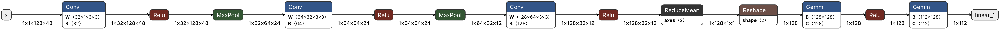
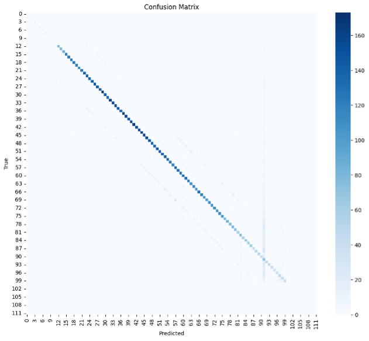

CNN CQT time frame 48 random slice

Modell Struktur:

Confusion Matrix:

Treningslogg:

LR: 0.001000
Epoch 01 | Train Loss: 2.5610 | Train Acc: 0.479 | Val Loss: 2.0275 | Val Acc: 0.652 | Time: 1068.6s  | 
Top1: 0.652 | Top3: 0.799 | Err: 6.20 | ±1: 0.662 | ±2: 0.669

LR: 0.001000
Epoch 02 | Train Loss: 2.0111 | Train Acc: 0.657 | Val Loss: 1.8619 | Val Acc: 0.702 | Time: 237.9s  | 
Top1: 0.702 | Top3: 0.827 | Err: 5.26 | ±1: 0.711 | ±2: 0.716

LR: 0.001000
Epoch 03 | Train Loss: 1.8921 | Train Acc: 0.691 | Val Loss: 1.7674 | Val Acc: 0.724 | Time: 225.9s  | 
Top1: 0.724 | Top3: 0.839 | Err: 5.03 | ±1: 0.735 | ±2: 0.742

LR: 0.001000
Epoch 04 | Train Loss: 1.8264 | Train Acc: 0.709 | Val Loss: 1.7116 | Val Acc: 0.742 | Time: 238.4s  | 
Top1: 0.742 | Top3: 0.848 | Err: 4.39 | ±1: 0.752 | ±2: 0.759

LR: 0.001000
Epoch 05 | Train Loss: 1.7864 | Train Acc: 0.720 | Val Loss: 1.6713 | Val Acc: 0.758 | Time: 218.6s  | 
Top1: 0.758 | Top3: 0.857 | Err: 4.15 | ±1: 0.767 | ±2: 0.774

LR: 0.001000
Epoch 06 | Train Loss: 1.7544 | Train Acc: 0.730 | Val Loss: 1.6665 | Val Acc: 0.755 | Time: 211.4s  | 
Top1: 0.755 | Top3: 0.853 | Err: 4.00 | ±1: 0.765 | ±2: 0.773

LR: 0.001000
Epoch 07 | Train Loss: 1.7323 | Train Acc: 0.735 | Val Loss: 1.6487 | Val Acc: 0.758 | Time: 217.3s  | 
Top1: 0.758 | Top3: 0.857 | Err: 3.98 | ±1: 0.767 | ±2: 0.774

LR: 0.001000
Epoch 08 | Train Loss: 1.7150 | Train Acc: 0.741 | Val Loss: 1.6189 | Val Acc: 0.773 | Time: 219.6s  | 
Top1: 0.773 | Top3: 0.861 | Err: 3.49 | ±1: 0.780 | ±2: 0.785

LR: 0.001000
Epoch 09 | Train Loss: 1.6974 | Train Acc: 0.746 | Val Loss: 1.6174 | Val Acc: 0.771 | Time: 223.5s  | 
Top1: 0.771 | Top3: 0.860 | Err: 4.21 | ±1: 0.782 | ±2: 0.788

LR: 0.001000
Epoch 10 | Train Loss: 1.6864 | Train Acc: 0.749 | Val Loss: 1.6324 | Val Acc: 0.763 | Time: 222.4s  | 
Top1: 0.763 | Top3: 0.857 | Err: 4.17 | ±1: 0.774 | ±2: 0.781

LR: 0.001000
Epoch 11 | Train Loss: 1.6732 | Train Acc: 0.753 | Val Loss: 1.6215 | Val Acc: 0.768 | Time: 217.6s  | 
Top1: 0.768 | Top3: 0.861 | Err: 4.56 | ±1: 0.776 | ±2: 0.780

LR: 0.001000
Epoch 12 | Train Loss: 1.6624 | Train Acc: 0.757 | Val Loss: 1.5930 | Val Acc: 0.777 | Time: 226.7s  | 
Top1: 0.777 | Top3: 0.861 | Err: 4.09 | ±1: 0.787 | ±2: 0.794

LR: 0.001000
Epoch 13 | Train Loss: 1.6527 | Train Acc: 0.759 | Val Loss: 1.5986 | Val Acc: 0.775 | Time: 220.5s  | 
Top1: 0.775 | Top3: 0.860 | Err: 4.19 | ±1: 0.783 | ±2: 0.791

LR: 0.001000
Epoch 14 | Train Loss: 1.6476 | Train Acc: 0.761 | Val Loss: 1.6142 | Val Acc: 0.773 | Time: 222.2s  | 
Top1: 0.773 | Top3: 0.857 | Err: 4.19 | ±1: 0.781 | ±2: 0.786

LR: 0.000500
Epoch 15 | Train Loss: 1.6379 | Train Acc: 0.764 | Val Loss: 1.6260 | Val Acc: 0.766 | Time: 227.1s  | 
Top1: 0.766 | Top3: 0.860 | Err: 4.31 | ±1: 0.776 | ±2: 0.781

LR: 0.000500
Epoch 16 | Train Loss: 1.6049 | Train Acc: 0.774 | Val Loss: 1.5741 | Val Acc: 0.780 | Time: 230.9s  | 
Top1: 0.780 | Top3: 0.865 | Err: 4.03 | ±1: 0.790 | ±2: 0.797

LR: 0.000500
Epoch 17 | Train Loss: 1.5979 | Train Acc: 0.776 | Val Loss: 1.5741 | Val Acc: 0.782 | Time: 224.3s  | 
Top1: 0.782 | Top3: 0.861 | Err: 3.87 | ±1: 0.792 | ±2: 0.800

LR: 0.000500
Epoch 18 | Train Loss: 1.5938 | Train Acc: 0.777 | Val Loss: 1.5854 | Val Acc: 0.774 | Time: 235.3s  | 
Top1: 0.774 | Top3: 0.864 | Err: 3.85 | ±1: 0.783 | ±2: 0.790

LR: 0.000500
Epoch 19 | Train Loss: 1.5906 | Train Acc: 0.778 | Val Loss: 1.5712 | Val Acc: 0.783 | Time: 226.3s  | 
Top1: 0.783 | Top3: 0.863 | Err: 3.64 | ±1: 0.793 | ±2: 0.801

LR: 0.000500
Epoch 20 | Train Loss: 1.5869 | Train Acc: 0.780 | Val Loss: 1.5730 | Val Acc: 0.783 | Time: 245.4s  | 
Top1: 0.783 | Top3: 0.865 | Err: 3.80 | ±1: 0.793 | ±2: 0.801