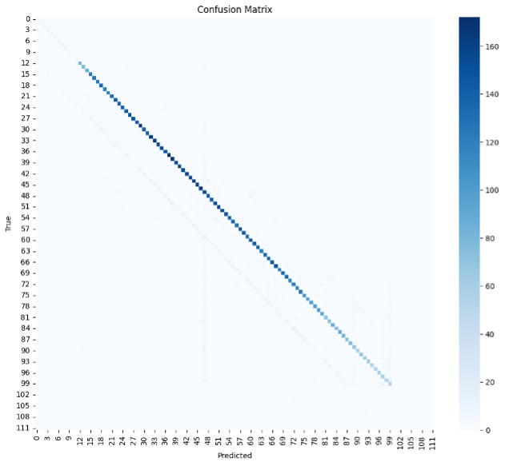

CNN cqt time frame 48 - Non-random slice

Modell Struktur:

Confusion Matrix:

Treningslogg:

LR: 0.001000
Epoch 01 | Train Loss: 2.4029 | Train Acc: 0.520 | Val Loss: 1.8548 | Val Acc: 0.695 | Time: 432.5s  | 
Top1: 0.695 | Top3: 0.853 | Err: 3.95 | ±1: 0.707 | ±2: 0.713

LR: 0.001000
Epoch 02 | Train Loss: 1.7845 | Train Acc: 0.723 | Val Loss: 1.6066 | Val Acc: 0.781 | Time: 132.8s  | 
Top1: 0.781 | Top3: 0.892 | Err: 3.10 | ±1: 0.791 | ±2: 0.796

LR: 0.001000
Epoch 03 | Train Loss: 1.6455 | Train Acc: 0.764 | Val Loss: 1.5187 | Val Acc: 0.801 | Time: 128.5s  | 
Top1: 0.801 | Top3: 0.908 | Err: 3.64 | ±1: 0.808 | ±2: 0.811

LR: 0.001000
Epoch 04 | Train Loss: 1.5754 | Train Acc: 0.783 | Val Loss: 1.4692 | Val Acc: 0.816 | Time: 126.8s  | 
Top1: 0.816 | Top3: 0.914 | Err: 3.16 | ±1: 0.823 | ±2: 0.826

LR: 0.001000
Epoch 05 | Train Loss: 1.5257 | Train Acc: 0.798 | Val Loss: 1.4269 | Val Acc: 0.830 | Time: 124.8s  | 
Top1: 0.830 | Top3: 0.923 | Err: 3.03 | ±1: 0.837 | ±2: 0.841

LR: 0.001000
Epoch 06 | Train Loss: 1.4920 | Train Acc: 0.808 | Val Loss: 1.4102 | Val Acc: 0.828 | Time: 125.5s  | 
Top1: 0.828 | Top3: 0.921 | Err: 2.99 | ±1: 0.835 | ±2: 0.839

LR: 0.001000
Epoch 07 | Train Loss: 1.4621 | Train Acc: 0.816 | Val Loss: 1.4034 | Val Acc: 0.833 | Time: 123.5s  | 
Top1: 0.833 | Top3: 0.922 | Err: 3.06 | ±1: 0.838 | ±2: 0.841

LR: 0.001000
Epoch 08 | Train Loss: 1.4401 | Train Acc: 0.823 | Val Loss: 1.4025 | Val Acc: 0.831 | Time: 125.5s  | 
Top1: 0.831 | Top3: 0.922 | Err: 2.34 | ±1: 0.839 | ±2: 0.843

LR: 0.001000
Epoch 09 | Train Loss: 1.4237 | Train Acc: 0.828 | Val Loss: 1.3759 | Val Acc: 0.838 | Time: 126.0s  | 
Top1: 0.838 | Top3: 0.929 | Err: 2.39 | ±1: 0.844 | ±2: 0.847

LR: 0.001000
Epoch 10 | Train Loss: 1.4073 | Train Acc: 0.833 | Val Loss: 1.3816 | Val Acc: 0.838 | Time: 126.7s  | 
Top1: 0.838 | Top3: 0.923 | Err: 2.36 | ±1: 0.845 | ±2: 0.849

LR: 0.001000
Epoch 11 | Train Loss: 1.3940 | Train Acc: 0.837 | Val Loss: 1.3721 | Val Acc: 0.840 | Time: 126.3s  | 
Top1: 0.840 | Top3: 0.927 | Err: 2.33 | ±1: 0.848 | ±2: 0.850

LR: 0.001000
Epoch 12 | Train Loss: 1.3824 | Train Acc: 0.840 | Val Loss: 1.3736 | Val Acc: 0.840 | Time: 131.0s  | 
Top1: 0.840 | Top3: 0.927 | Err: 2.43 | ±1: 0.847 | ±2: 0.849

LR: 0.001000
Epoch 13 | Train Loss: 1.3727 | Train Acc: 0.843 | Val Loss: 1.3511 | Val Acc: 0.846 | Time: 125.5s  | 
Top1: 0.846 | Top3: 0.927 | Err: 2.17 | ±1: 0.852 | ±2: 0.855

LR: 0.001000
Epoch 14 | Train Loss: 1.3624 | Train Acc: 0.847 | Val Loss: 1.3461 | Val Acc: 0.845 | Time: 124.1s  | 
Top1: 0.845 | Top3: 0.928 | Err: 2.16 | ±1: 0.853 | ±2: 0.856

LR: 0.001000
Epoch 15 | Train Loss: 1.3536 | Train Acc: 0.849 | Val Loss: 1.3385 | Val Acc: 0.852 | Time: 127.0s  | 
Top1: 0.852 | Top3: 0.929 | Err: 2.14 | ±1: 0.858 | ±2: 0.862

LR: 0.001000
Epoch 16 | Train Loss: 1.3490 | Train Acc: 0.850 | Val Loss: 1.3481 | Val Acc: 0.847 | Time: 129.5s  | 
Top1: 0.847 | Top3: 0.927 | Err: 2.24 | ±1: 0.853 | ±2: 0.856

LR: 0.001000
Epoch 17 | Train Loss: 1.3419 | Train Acc: 0.853 | Val Loss: 1.3498 | Val Acc: 0.846 | Time: 126.9s  | 
Top1: 0.846 | Top3: 0.926 | Err: 2.74 | ±1: 0.853 | ±2: 0.855

LR: 0.000500
Epoch 18 | Train Loss: 1.3322 | Train Acc: 0.856 | Val Loss: 1.3507 | Val Acc: 0.844 | Time: 125.9s  | 
Top1: 0.844 | Top3: 0.927 | Err: 2.65 | ±1: 0.850 | ±2: 0.853

LR: 0.000500
Epoch 19 | Train Loss: 1.3030 | Train Acc: 0.865 | Val Loss: 1.3258 | Val Acc: 0.852 | Time: 129.9s  | 
Top1: 0.852 | Top3: 0.930 | Err: 2.15 | ±1: 0.860 | ±2: 0.863

LR: 0.000500
Epoch 20 | Train Loss: 1.2974 | Train Acc: 0.867 | Val Loss: 1.3293 | Val Acc: 0.848 | Time: 127.8s  | 
Top1: 0.848 | Top3: 0.928 | Err: 2.22 | ±1: 0.856 | ±2: 0.859

Oppsummering:
Mye bedre Val acc og betydelig mindre Err. 