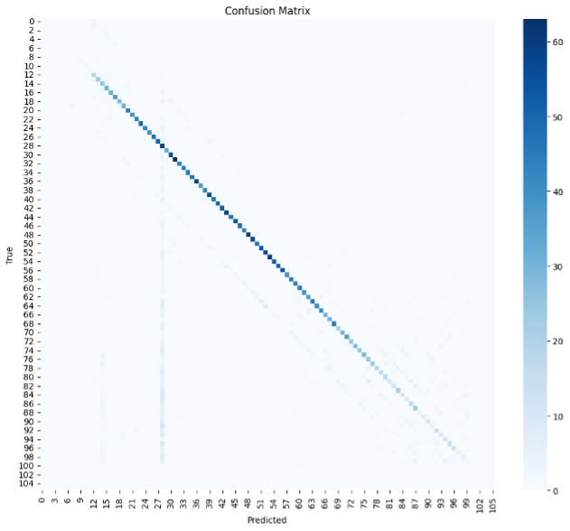

CNN mel 128 time frame 32 random slice

Modell Struktur:

Confusion Matrix:

Treningslogg:

LR: 0.001000
Epoch 01 | Train Loss: 1.1151 | Train Acc: 0.716 | Val Loss: 1.1595 | Val Acc: 0.723 | Time: 123.9s  | 
Top1: 0.723 | Top3: 0.825 | Err: 6.88 | ±1: 0.740 | ±2: 0.753

LR: 0.001000
Epoch 02 | Train Loss: 1.0908 | Train Acc: 0.722 | Val Loss: 1.1830 | Val Acc: 0.717 | Time: 124.4s  | 
Top1: 0.717 | Top3: 0.821 | Err: 6.27 | ±1: 0.732 | ±2: 0.747

LR: 0.001000
Epoch 03 | Train Loss: 1.0777 | Train Acc: 0.724 | Val Loss: 1.1929 | Val Acc: 0.723 | Time: 121.6s  | 
Top1: 0.723 | Top3: 0.821 | Err: 7.18 | ±1: 0.742 | ±2: 0.753

LR: 0.000500
Epoch 04 | Train Loss: 1.0679 | Train Acc: 0.727 | Val Loss: 1.1924 | Val Acc: 0.727 | Time: 119.2s  | 
Top1: 0.727 | Top3: 0.816 | Err: 4.54 | ±1: 0.746 | ±2: 0.758

LR: 0.000500
Epoch 05 | Train Loss: 1.0238 | Train Acc: 0.738 | Val Loss: 1.1407 | Val Acc: 0.738 | Time: 120.3s  | 
Top1: 0.738 | Top3: 0.828 | Err: 4.46 | ±1: 0.750 | ±2: 0.763

LR: 0.000500
Epoch 06 | Train Loss: 1.0120 | Train Acc: 0.741 | Val Loss: 1.1701 | Val Acc: 0.729 | Time: 125.6s  | 
Top1: 0.729 | Top3: 0.828 | Err: 6.11 | ±1: 0.747 | ±2: 0.755

LR: 0.000500
Epoch 07 | Train Loss: 1.0025 | Train Acc: 0.744 | Val Loss: 1.1392 | Val Acc: 0.732 | Time: 132.4s  | 
Top1: 0.732 | Top3: 0.827 | Err: 6.26 | ±1: 0.749 | ±2: 0.763

LR: 0.000500
Epoch 08 | Train Loss: 1.0022 | Train Acc: 0.744 | Val Loss: 1.1344 | Val Acc: 0.737 | Time: 128.1s  | 
Top1: 0.737 | Top3: 0.827 | Err: 6.42 | ±1: 0.753 | ±2: 0.763

LR: 0.000500
Epoch 09 | Train Loss: 0.9970 | Train Acc: 0.746 | Val Loss: 1.1617 | Val Acc: 0.731 | Time: 128.0s  | 
Top1: 0.731 | Top3: 0.825 | Err: 4.68 | ±1: 0.749 | ±2: 0.763

LR: 0.000500
Epoch 10 | Train Loss: 0.9897 | Train Acc: 0.747 | Val Loss: 1.1675 | Val Acc: 0.740 | Time: 123.7s  | 
Top1: 0.740 | Top3: 0.830 | Err: 7.03 | ±1: 0.754 | ±2: 0.764

LR: 0.000250
Epoch 11 | Train Loss: 0.9844 | Train Acc: 0.748 | Val Loss: 1.1482 | Val Acc: 0.742 | Time: 126.0s  | 
Top1: 0.742 | Top3: 0.839 | Err: 6.79 | ±1: 0.757 | ±2: 0.771

LR: 0.000250
Epoch 12 | Train Loss: 0.9593 | Train Acc: 0.756 | Val Loss: 1.1529 | Val Acc: 0.737 | Time: 125.9s  | 
Top1: 0.737 | Top3: 0.831 | Err: 6.12 | ±1: 0.750 | ±2: 0.761

LR: 0.000250
Epoch 13 | Train Loss: 0.9550 | Train Acc: 0.756 | Val Loss: 1.1888 | Val Acc: 0.741 | Time: 125.2s  | 
Top1: 0.741 | Top3: 0.825 | Err: 5.88 | ±1: 0.757 | ±2: 0.770

LR: 0.000125
Epoch 14 | Train Loss: 0.9528 | Train Acc: 0.757 | Val Loss: 1.1529 | Val Acc: 0.744 | Time: 126.4s  | 
Top1: 0.744 | Top3: 0.837 | Err: 5.95 | ±1: 0.758 | ±2: 0.768

LR: 0.000125
Epoch 15 | Train Loss: 0.9380 | Train Acc: 0.761 | Val Loss: 1.1609 | Val Acc: 0.742 | Time: 125.5s  | 
Top1: 0.742 | Top3: 0.824 | Err: 6.13 | ±1: 0.756 | ±2: 0.765

LR: 0.000125
Epoch 16 | Train Loss: 0.9378 | Train Acc: 0.762 | Val Loss: 1.1787 | Val Acc: 0.736 | Time: 127.7s  | 
Top1: 0.736 | Top3: 0.832 | Err: 5.97 | ±1: 0.752 | ±2: 0.764

LR: 0.000063
Epoch 17 | Train Loss: 0.9319 | Train Acc: 0.763 | Val Loss: 1.1596 | Val Acc: 0.742 | Time: 126.4s  | 
Top1: 0.742 | Top3: 0.828 | Err: 5.95 | ±1: 0.759 | ±2: 0.769

LR: 0.000063
Epoch 18 | Train Loss: 0.9266 | Train Acc: 0.765 | Val Loss: 1.1165 | Val Acc: 0.749 | Time: 129.2s  | 
Top1: 0.749 | Top3: 0.839 | Err: 5.77 | ±1: 0.764 | ±2: 0.775

LR: 0.000063
Epoch 19 | Train Loss: 0.9276 | Train Acc: 0.765 | Val Loss: 1.1516 | Val Acc: 0.746 | Time: 125.2s  | 
Top1: 0.746 | Top3: 0.835 | Err: 5.74 | ±1: 0.762 | ±2: 0.772

LR: 0.000063
Epoch 20 | Train Loss: 0.9260 | Train Acc: 0.766 | Val Loss: 1.1390 | Val Acc: 0.746 | Time: 120.8s  | 
Top1: 0.746 | Top3: 0.832 | Err: 5.73 | ±1: 0.763 | ±2: 0.773

Oppsummering:

Trening flatet ut raskt, noe som tyder på at flere epoker ikke er nødvendig.
Kan være at det er begrenset hvor mye som kan hentes ut av mel 128, derfor prøve CQT med samme modell

